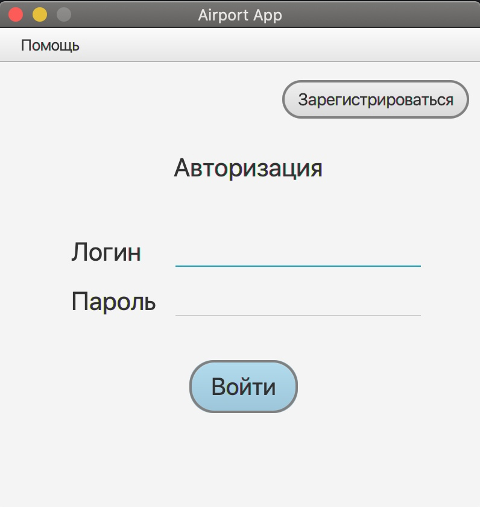
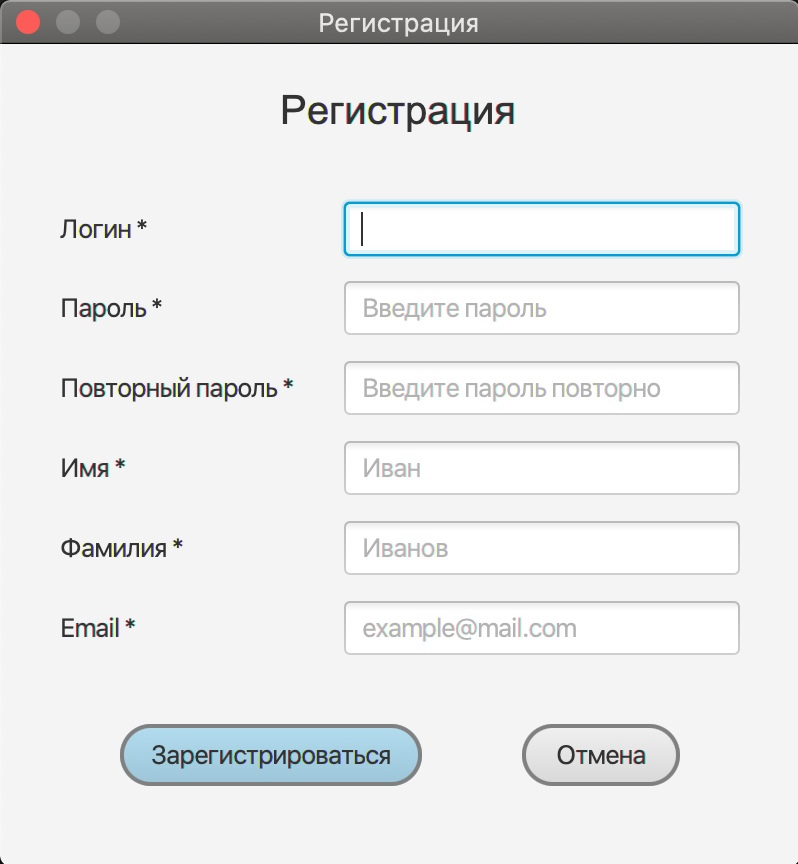
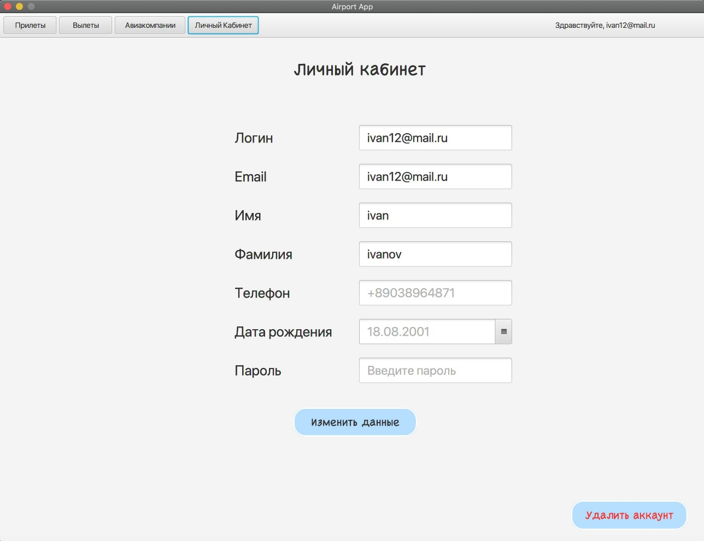
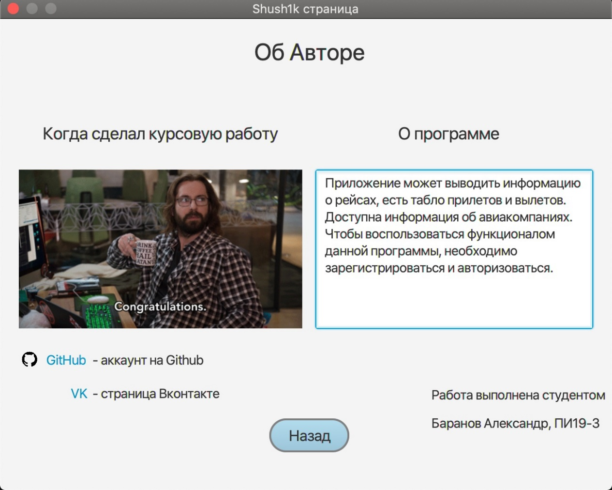
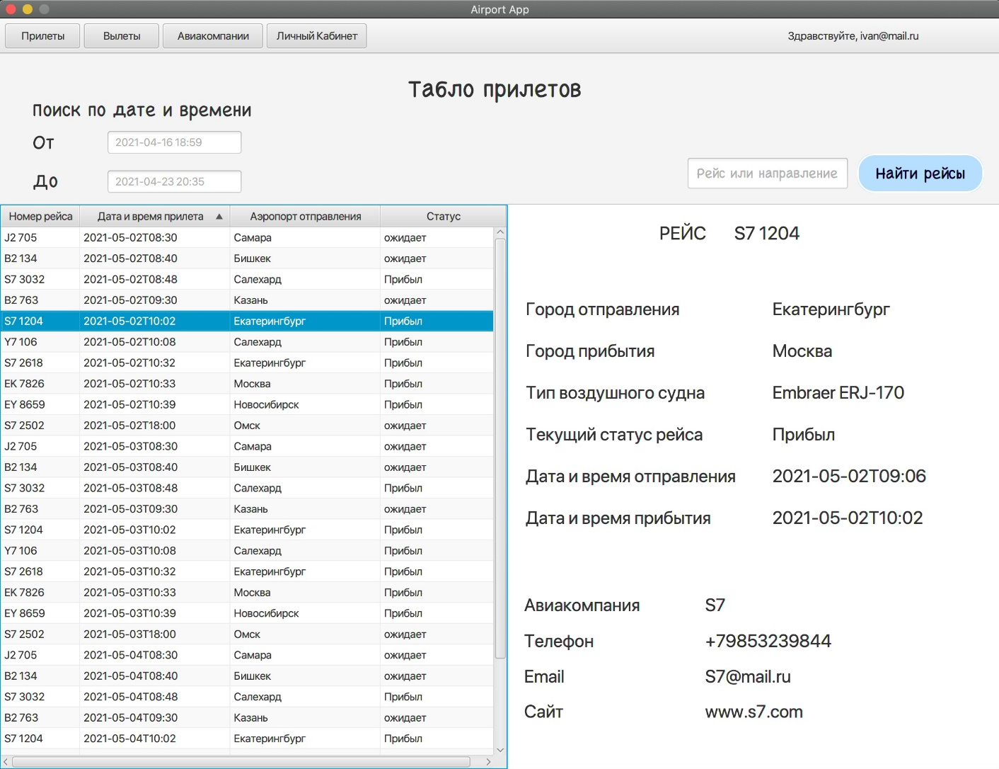
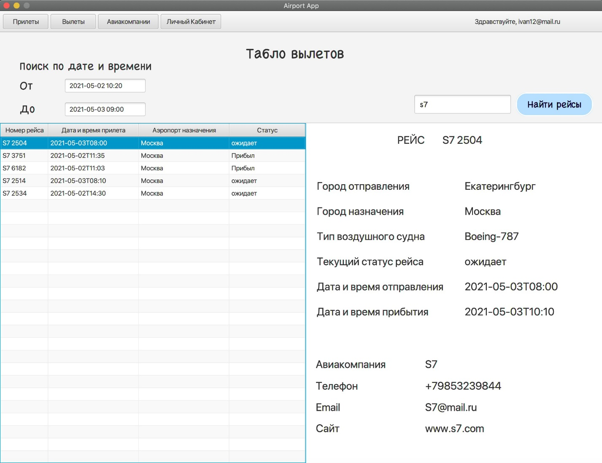
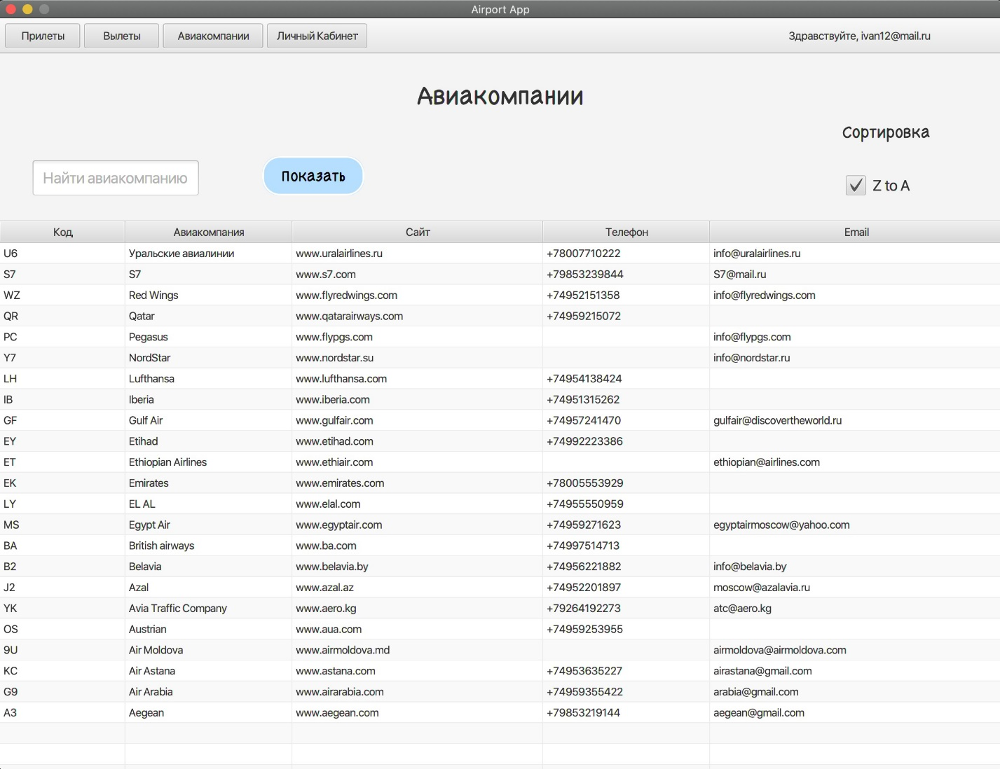

# AirportClient. Курсовая работа.
## Клиентская часть Информационно-справочной системы аэропорта.  

---
Данный проект является Desktop приложением на Java, в качестве графического интерфейса выбран JavaFX. Целью сервиса является предоставление информации о данных аэропорта для пользователей приложения.

### Основные задачи приложения:

* **Предоставить взаимодействие с методами RESTful сервиса через графический интерфейс** <a href="https://github.com/Shush1k/AirportServer/tree/main"><small>(ref)</small></a>
* **Возможность зарегистрироваться и авторизоваться**
* **Обработка ошибок и валидация данных**: ошибка ввода, неправильный пароль, отсутствие необходимого поля
* **Фильтрация и поиск записей**: Поиск по номеру рейса, фильтрация по дате вылета или прилета

Виды страниц:
* *об Авторе*
* *ЛК пользователя*
* *Авиакомпании*
* *Вылеты*
* *Прилеты*
* *Регистрации*
* *Авторизации*

### Demo JavaFX UI
Демонстрация Desktop приложения

---
<!-- 1 -->

    <h4>Страница Авторизации</h4>
    

<!-- 2 -->

    <h4>Страница Регистраиции</h4>
    

<!-- 3 -->

    <h4>Страница ЛК</h4>
    

<!-- 4 -->

    <h4>Страница об Авторе</h4>
    

<!-- 5 -->

    <h4>Страница Рейсов</h4>
    

<!-- 6 -->

    <h4>Страница Рейсов (Фильтрация)</h4>
    

<!-- 7 -->

    <h4>Страница Авиакомпаний</h4>
    

---

### RESTful сервис

<a href="https://github.com/Shush1k/AirportServer/tree/main">Серверная часть приложения (REST API)</a>